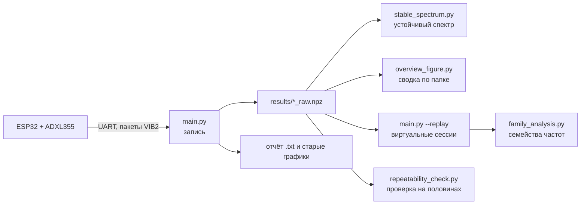

# Обзор проекта

## Цель

Найти собственные частоты здания по слабым фоновым вибрациям (микротремору)
и получать один и тот же ответ при повторных измерениях.

## Оборудование

| Узел | Что это |
|---|---|
| Датчик | ADXL355, трёхосевой MEMS-акселерометр с низким шумом |
| Контроллер | ESP32, прошивка не входит в этот репозиторий |
| Связь | UART, 115200 бод, порт задаётся в [[Конфигурация config.toml]] (сейчас `COM8`) |
| Пакет | `VIB2`: заголовок `N, _, elapsed_us, sequence`, затем N отсчётов X, Y, Z в формате int32, делённые на 256000, в g |
| Частота опроса (ODR) | 250, 125 или 62,5 Гц; фактически при ODR 250 выходит около 252,77 Гц |
| Длина пакета | 1024 отсчёта, около 4,05 с при ODR 250 |

Команда смены ODR отправляется в прошивку при старте записи: байт `0x01` и
параметр `0x00`, `0x01` или `0x02`. Подробности формата и порядка запуска:
[[Протокол VIB2 и сбор данных]].

## Конвейер обработки

Главный результат даёт [[stable_spectrum.py]]. Старый детектор внутри
[[main.py]] использует фиксированные пороги в дБ, поэтому его картинка
меняется от прогона к прогону. Подробности в [[Почему результаты скачут]].

## Файлы репозитория

| Файл | Назначение |
|---|---|
| `main.py` | запись, старый анализ, повторный разбор записи; [[main.py]] |
| `stable_spectrum.py` | устойчивый спектр; [[stable_spectrum.py]] |
| `overview_figure.py` | сводная картинка по папке; [[overview_figure.py]] |
| `repeatability_check.py` | повторяемость на половинах записи; [[repeatability_check.py]] |
| `family_analysis.py` | семейства частот; [[family_analysis.py]] |
| `config.toml` | настройки; [[Конфигурация config.toml]] |
| `test_*.py` | тесты; [[Тесты]] |
| `README.md` | англоязычное описание в репозитории |
| `obsidian_vault/` | это хранилище |

Папки с данными описаны в [[Где лежат данные]].
